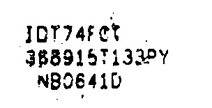

# continuancely clean image to extracte only Meaningful pixels
first of all i apologize for my english. I am an electrical engineering PhD student in university of Tehran, Iran.  
The way the code works is as follows: 
 1. define sweep windows size. 
 2. start to sweep continuncely in x, y. 
 3. if there is a window that the text_pixel/total_pixel is within the specified range this window will pass the filter and copy in new image named cleared_image. 
 4. the original image and the cleared image will be demonstrated in vertical way. 
In addition, the next idea is that if the number of black pixels on the white background of the image is greater than a limit (which we specified with the name "symbol_pixel_ratio") in this case, that window will be identified as the window containing the symbol and will be deleted. 
It should be mentioned that the third idea implemented in this coding is that the input parameter called "crop_around" is defined, and when it is active, the final step in the windows of the x and y axes will always be cleared. 
if there is a problem cantact me using my email address: sh.dalirian@ut.ac.ir 
my linkedin profile address is : linkedin.com/in/sh-d-30174b77  
## run: main.py

## application:
Clearing windows with very low and very high pixel density

## adjustable parameters:
text_pixel_ratio to total pixels is defined as input parameter and has defualt value equal to 20%  
symbol_pixel_ratio to total pixels is defined as input parameter and has defualt value equal to 70%  
this code is generaly written for all black or white background which can de adjusted using "is_background_white" input parameter and has defualt value equal to True  
## example:
here is some examples: 
### example 1:
<kbd>original image is:   
cleaned image is:   
<kbd/>
if it is not continunce the output image will be:     discrete_cleaned_img
the code for discrete image cleaner is here: https://github.com/ShDalirian/windows_cleaner_image.git
